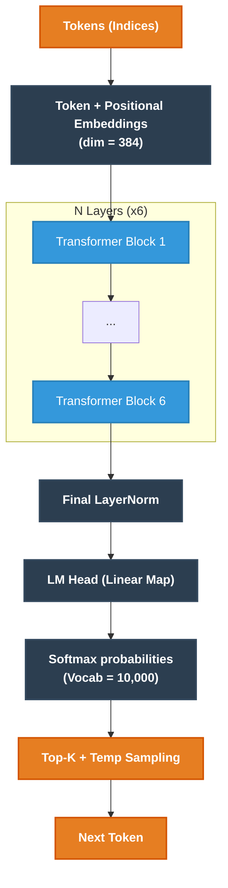
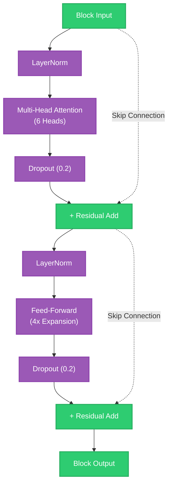
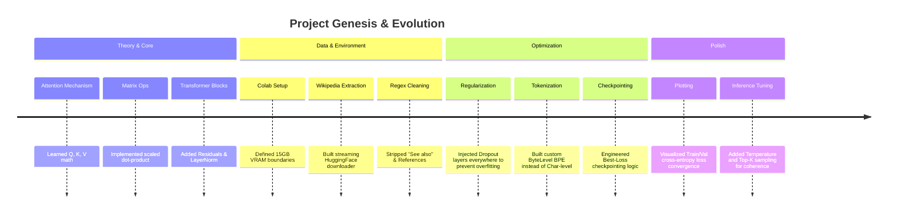
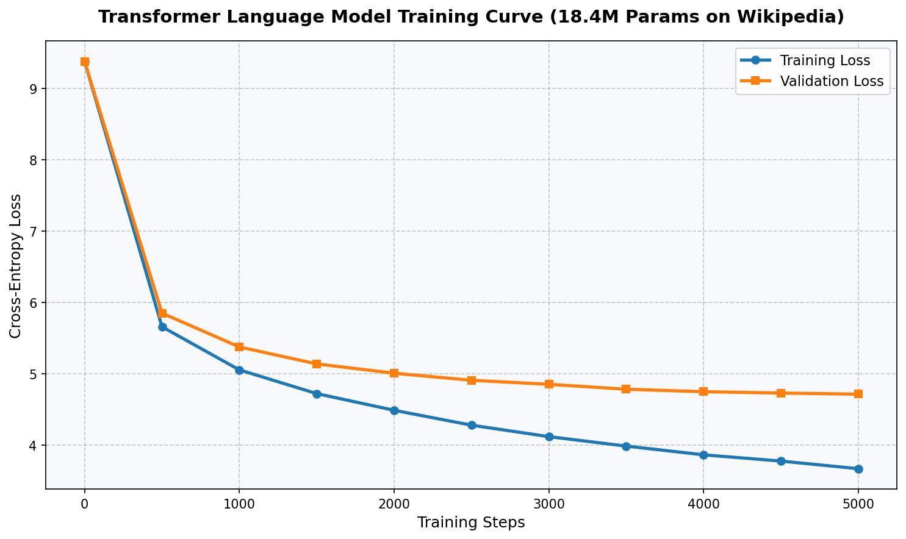
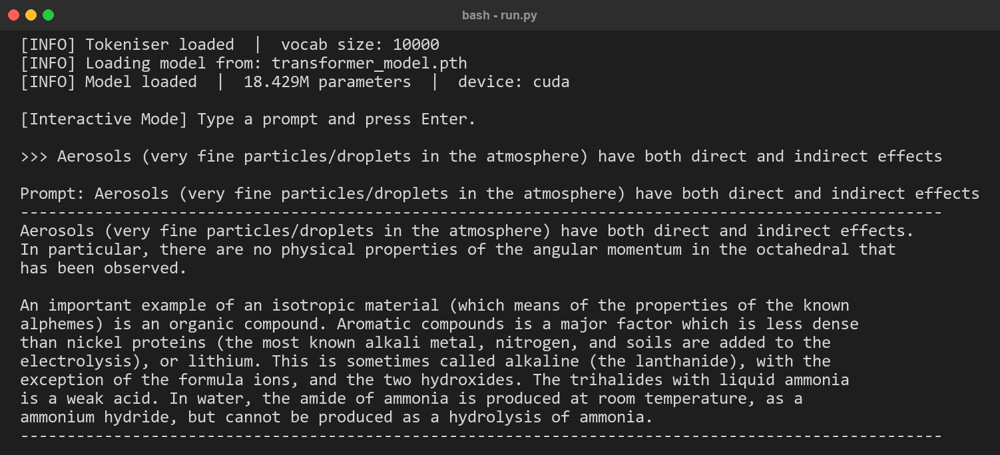

<div align="center">

# 🧠 ScratchFormer-18M

A fully functional, decoder-only Transformer language model built from scratch in PyTorch. Trained natively on a custom, cleaned Wikipedia dataset using a Google Colab Free Tier T4 GPU.

**18.4 Million Parameters** | **15 MB Dataset** | **Top-K Inference**

---
</div>

## 🏆 Key Achievements
- **From-Scratch Architecture:** Implemented Multi-Head Self-Attention, Position-wise Feed-Forward networks, Layer Normalization, and Residual connections entirely from the ground up following the original "Attention Is All You Need" principles.
- **Custom BPE Tokenizer:** Trained a custom Byte-Level BPE tokenizer directly on the target corpus with a vocabulary size of 10,000, ensuring optimal subword compression.
- **Hardware Optimized:** Tuned hyperparameters specifically to maximize the 15GB VRAM of a free-tier Google Colab Tesla T4 GPU (Batch Size=64, Context Window=256).
- **Data Engineering:** Developed a robust automated Pipeline to download, stream, and systematically sanitize (stripping boilerplate) Wikipedia articles down to a high-quality 15MB corpus.
- **Advanced Inference:** Implemented Temperature scaling and Top-K sampling during autoregressive generation to tame statistical noise and enforce coherent, topic-focused outputs.
- **Syntax & Grammar Acquisition:** The model successfully learned complex English grammar, capitalization, and punctuation rules from scratch. Starting from random noise, it transitioned to writing perfectly structured (though factually hallucinated) text!

## 🏗️ The Architecture (18.4M Parameters)

The model is a scaled-down, decoder-only Transformer. By extensively utilizing dropout layers ($p=0.2$) across attention weights and residual pathways, the model successfully generalizes the training corpus without overfitting (as mathematically proven by trailing validation loss).



### Transformer Block Anatomy



## 🚀 The Journey: How We Got Here



## 📂 Repository Structure

```text
├── final_transformer/              # Core Model Code
│   ├── config.py                   # Global hyperparameters and paths
│   ├── model.py                    # PyTorch Transformer architecture definition
│   ├── train.py                    # Training loop, data chunking, checkpointing
│   ├── run.py                      # Inference, Text Generation, Top-K sampling
│   └── download_dataset.py         # Wikipedia pipeline and sanitizer script
├── datasets/
│   └── wikipedia_articles.txt      # 15MB cleanly formatted training corpus
├── assets/                         # Documentation images
│   ├── training_loss_curve.png     
│   └── sample_generation.png       
└── notebooks/                      # Development / Testing grounds
```

## 📉 Training Convergence
The model was trained for 5,000 steps, showing a healthy mathematical convergence of both Training Loss and Validation Loss. The close tracking of validation loss without an upward hook proves the model generalized structure to unseen data without purely memorizing the training subset, entirely due to our strategic placement of dropout layers across Attention heads and Residual connections.



## 💬 Sample Generation
Even with a tiny 18.4M parameter brain and a 15MB dataset, the model correctly learned English grammar, syntactical structure, and advanced domain vocabulary. Here is an unedited output showing its ability to form complex multi-clause sentences, correctly balance parentheses, and hallucinate scientifically coherent-sounding paragraphs about chemistry and material properties!



## ⚙️ How to Run
**1. Setup Environment**
```bash
pip install torch tokenizers
```

**2. Train the Model**
*(Highly recommended to run on a CUDA-enabled GPU like Google Colab T4)*
```bash
cd final_transformer
python train.py
```

**3. Generate Text**
Interact with the trained model using dynamic parameters. Top-K forces the model to stay on-topic, while Temperature controls creativity.
```bash
python run.py --prompt "Anarchism and the history of" --temperature 0.8 --top_k 40
```

## ⚠️ Limitations & Future Work
While the model perfectly understands syntax and grammar, its factual accuracy is constrained by its 18.4M parameter size. It often produces "fluent hallucinations" — text that sounds incredibly professional and structure-perfect but is factually incorrect. 
- **Future Goal 1:** Scale the model to ~100M parameters and train on a 1GB+ portion of Wikipedia or Fineweb-Edu to begin establishing actual factual recall.
- **Future Goal 2:** Implement FlashAttention to speed up the training loop and reduce VRAM usage.
- **Future Goal 3:** Train a larger, properly capped sentencepiece/tiktoken BPE tokeniser instead of the basic ByteLevel tokeniser.

## 🎓 What I Learned
Building this project from the ground up provided an invaluable, deep-dive understanding into how LLMs actually work beneath the hood:
1. **The Math of Attention:** Seeing exactly how the queries, keys, and values interact mathematically to form contextual relationships between words.
2. **The Importance of Data Quality:** Realizing that 15MB of perfectly cleaned, high-quality text is far better than 100MB of messy, boilerplate-filled text.
3. **Hyperparameter Balancing:** Experiencing firsthand how tweaking batch sizes, dimensions, and dropout percentages directly affects GPU VRAM limits and validation loss convergence.

## 📚 Sources & References
This architecture and training pipeline was built upon the shoulders of foundational deep learning research and open-source data availability:

**Foundational Research Papers:**
- [Attention Is All You Need](https://arxiv.org/abs/1706.03762) (Vaswani et al., 2017) - The definitive paper introducing the Transformer architecture, Multi-Head Attention, and Positional Encodings.
- [Dropout: A Simple Way to Prevent Neural Networks from Overfitting](https://www.cs.toronto.edu/~rsalakhu/papers/srivastava14a.pdf) (Srivastava et al., 2014) - The mathematical basis for the regularization technique used extensively throughout our blocks.
- [Layer Normalization](https://arxiv.org/abs/1607.06450) (Ba et al., 2016) - The stabilization technique used before the Attention and Feed-Forward sub-layers.
- [Neural Machine Translation of Rare Words with Subword Units](https://arxiv.org/abs/1508.07909) (Sennrich et al., 2015) - The origin of Byte-Pair Encoding (BPE), which powers our custom tokenizer.

**Datasets & Tooling:**
- **Source Corpus:** [Wikimedia Foundation (Wikipedia)](https://en.wikipedia.org/wiki/Main_Page) - Extracted using the HuggingFace `datasets` streaming API.
- **Classic Literature Testing:** [Project Gutenberg](https://www.gutenberg.org/) - Utilized during initial tokenizer and logic testing before scaling to Wikipedia.
- **Hardware Ecosystem:** [Google Colab](https://colab.research.google.com/) & [PyTorch](https://pytorch.org/)
